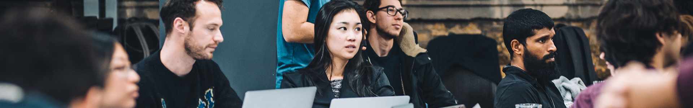

# Aletheia Photo Mosaic


Aletheia Photo Mosaic is a university project developed and realized with p5.js library in the Creative Coding class, taught by Michele Mauri and Andrea Benedetti at Politecnico di Milano.

## Introduction


Everyone loves music. You might listen to it a lot, or you might just let it play in the background when you really don't have anything else to do. Whichever you do, there's no doubt that you have an artist that you like more than everyone else. Every time he announces the release of a new album, you start to wonder what amazing new songs could be in it. You really can't wait for it to come out. And when that happens, you're happier than ever. You start to listen to the new songs over and over, from when you wake up to the moment you go to sleep. Unfortunately, there's a small drawback: once the album is out, you quickly forget all the emotions and all the suspense that you felt before the release. While you still enjoy the music - it's still your favourite artist - you're sad that all that thrill you previously felt is now gone.

## Project Idea

We thought that the reason you lose all the hype for the album release is that you never truly took part in it. You were just a spectator. We wanted to change that. The problem was: "What is the best way for you to be the protagonist of the release, while preserving the personality of the album?" In our opinion, the answer to this question lies in the album cover.
We thought that the best way to make the fans interact with the cover was to let them discover it bit by bit. In order to do that, we used a technique called photo mosaic: basically, you take an image and resize it, lowering its resolution. Then, you replace each of its pixels with other images, so that each of them has a brightness similar to the one of the corresponding pixel. In other words, you take a bunch of images and you rearrange them in a grid so that they recreate another image.

We created an app that will do exactly that: each user will be asked to take a picture. Then, our app will take all the pictures taken by the fans and rearrange them in order to recreate the cover. The users will be able to see the progress of the mosaic any time they want. When enough pictures will be uploaded, the cover will be completely formed, and the fans will be able to enjoy the image they managed to create.

## Development


We first found all the RGB values of each pixel of every image. Then, we calculated the arithmetic average of said values, thus creating an average color for each image. After that, we used the "brightness" function in order to find the brightness of the color, and stored all these values in an array.
```
function findImageBrightness() {


  for (let i = 0; i < allImages.length; i++) {
    // allImages[i].filter(GRAY);
    allImages[i].loadPixels();

    var rSum = 0;
    var gSum = 0;
    var bSum = 0;
    var r, g, b;
    var c;

    //...sum the r,g,b values of each pixel...
    for (let x = 0; x < allImages[i].width; x++) {
      for (let y = 0; y < allImages[i].height; y++) {
        c = allImages[i].get(x, y);
        rSum += c[0];
        gSum += c[1];
        bSum += c[2];
      }
    }

    //...then divide for the number of pixels that compose the image to find the average r,g,b values...
    var pixNumber = allImages[i].pixels.length / 4;
    r = floor(rSum / pixNumber);
    g = floor(gSum / pixNumber);
    b = floor(bSum / pixNumber);

    //...and find the hue ov the average color of the image...
    var avgRGB = color(r, g, b);
    push();
    colorMode(HSB, 360, 100, 100, 1);

    var avgBrg = floor(brightness(avgRGB));
    pop();

    //...and store the average brightness value of each image in an array
    brgValues[i] = avgBrg;
  }
  //if loading == 3 --> analyzing the brightness of the cover
  loading = 3;

  analyzeCoverPixels();
}
```
We found the brightness of every pixel the same way we found the brightness value for all the other images. After that, we compared every pixel with every image with different "for" cycles, so that we could find the best image to replace every pixel. We also used another array to store a counter for every image, so that they could only be displayed a set number of times.
```
function analyzeCoverPixels() {

  smaller.loadPixels();
  // for every pixel of the cover (resized)
  for (var x = 0; x < w; x++) {
    for (var y = 0; y < h; y++) {
      //index = numero del pixel della cover
      var index = x + y * w;

      //get the color of the pixel
      var tempC = smaller.get(x, y);

      // push();

      var tempB = int(brightness(tempC));

      //find the fist submitted photo with brightness == to the pixel of the cover
      for (i = 0; i < allImages.length; i++) {

        if (tempB == brgValues[i]) {
          var index = x + y * w;

          if (numeroUtilizzi[i] < numeroMaxUtilizzi) {
            //console.log(allImages[i] + ' used');
            numeroUtilizzi[i] += 1;
            immaginiDaUsare[index] = allImages[i];

            //in order not to have the same tile in many adjacent pixel with the same brightness value
            //copy the values at the end of the array
            allImages.push(allImages[i]);
            brgValues.push(brgValues[i]);
            numeroUtilizzi.push(numeroUtilizzi[i]);
            //and remove the used image from its original position in the arrays
            //and probably in the next cycle another matching image will be find before the one used here
            allImages.splice(i, 1);
            brgValues.splice(i, 1);
            numeroUtilizzi.splice(i, 1);

          } else if (numeroUtilizzi[i] == numeroMaxUtilizzi) {
            //console.log(allImages[i] + ' removed');
            allImages.splice(i, 1);
            brgValues.splice(i, 1);
            numeroUtilizzi.splice(i, 1);
          }
          //end the for cycle
          //analyze the next pixel of the cover
          i = allImages.length;
        }
      }
    }
  }

  drawMosaic();
  showButtons();

  var tiles_utilizzate = quadratiNeri + fotoUsate
}
```

## Code Challenges


The initial goal was to create a coloured photo mosaic. We wanted to find a way to compare the HSB values (hue, saturation and brightness) of each pixel of the cover with the average HSB values of each image, so as to find the best matching image for each pixel. The problem was that, in order to find the HSB values of each image, we first extracted the HSB values for every pixel of every image, then we calculated the arithmetic average of these values. But the averege color of an image is not necessarily the dominant color of that image. Take the color palette of a painter, for example: if you mix even a bit of black paint with a random quantity of yellow paint, the color you will get will be vastly different from yellow, even you know for sure that most of the paint was previously yellow. The same happens when you calculate the average HSB values of an image. Therefore, when you replace a pixel with an image, the result might be different from what you expected. Another issue was that the color distance, which could be used as a parameter when looking for the best image, is calculated through a non-linear formula. This means that different colors might have the same distance from the color you're looking for.

We also experienced various difficulties when trying to create the matching algorithm itself. We needed something that could not only associate images to pixels, but also make it so that images were not used more than a set number of times, in order to guarantee that the largest number of images is used. In order to overcome this challenges, we did an in-depth study of pixel arrays, which allowed us to find the correct matchin algorithm.

Lastly, we also needed to find a way to store all the photos taken by the users. For this purpose we used Firebase, which allowed us to have a place for as many images as we needed. Initially, we couldn't understand how to take a picture and save it on the server; we could only upload it from our gallery. However, after spending a bit of time understanding how Firebase works, we managed to accomplish this goal.

## References


## Credits
- p5.js
- Firebase
- Daniel Shiffman

## The Team
Lorenzo Barilla, Federico Lucifora, Elisa Manzoni, Matilde Teani

Creative Coding 2019/2020 - https://drawwithcode.github.io/2019/        
Politecnico di Milano - Scuola del Design     
Faculty: Michele Mauri, Andrea Benedetti

